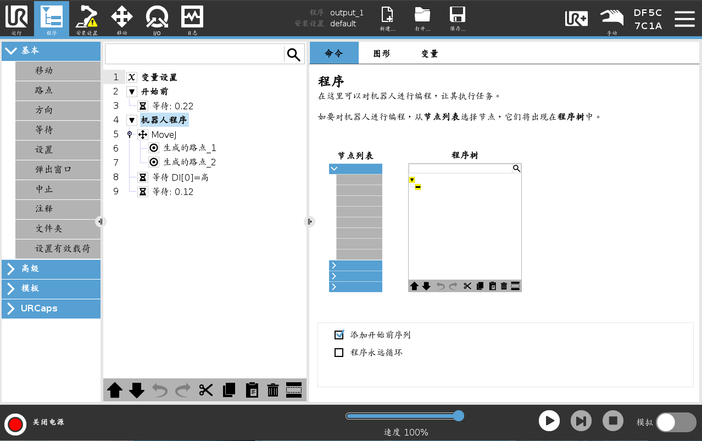

# URP Syntax

The following is a brief syntax description refined based on the UR Robot Program (URP) format specification and combined with the XML structure. It includes node hierarchies, attribute definitions, and examples.

Version: 1.0.0

Date: 2025 April 30

Author: funh (funh@universal-robots.com)


## 1. Root Node: `<URProgram>`

### Function

Represents the root container of the entire UR program, containing program metadata and core content.

### Attributes (Required)

| Attribute Name                      | Type   | Description                                                  | Example Value                                                |
| ----------------------------------- | ------ | ------------------------------------------------------------ | ------------------------------------------------------------ |
| `name`                              | String | Program name                                                 | `"MyProgram"`                                                |
| `installation`                      | String | Installation configuration name (default value: `"default"`) | `"custom_install"`                                           |
| `installationRelativePath`          | String | Relative path of the installation path (default value: `"default"`) | `"/installations"`                                           |
| `directory`                         | String | Program storage directory (URSim path)                       | `"/home/ur/ursim/programs"`                                  |
| `createdIn`                         | String | URSim version in which the program was created (format: `"X.Y.Z"`) | `"5.15.0"`                                                   |
| `lastSavedIn`                       | String | URSim version in which the program was last saved            | `"5.15.0"`                                                   |
| `robotSerialNumber`                 | String | Robot serial number (e.g., serial numbers of `UR3e`, `UR10e`) | `"20195599999"`                                              |
| `createdInPolyscopeProgramVersion`  | String | PolyScope version in which the program was created           | `"2"`                                                        |
| `lastSavedInPolycopeProgramVersion` | String | PolyScope version in which the program was last saved        | `"2"`                                                        |
| `crcValue`                          | String | Program checksum (must be equal to the CRC value in the upper right corner of the teach pendant, here it is a decimal value) | If the value shown on the robot is DF5C7C1A, the corresponding value here is `"3747380250"` in decimal. |

### Child Nodes (Required)

- `<kinematics>`: Kinematic parameter configuration (see below).
- `<children>`: Program node container, containing initialization, special sequences, main program, etc.


## 2. Kinematic Configuration Node: `<kinematics>`

### Function

Defines the robot's kinematic parameters (DH parameters) and status.

### Attributes (Required)

| Attribute Name | Type   | Description                                           | Example Value     |
| -------------- | ------ | ----------------------------------------------------- | ----------------- |
| status         | String | Kinematic status (values: "NOT_INITIALIZED", "VALID") | "NOT_INITIALIZED" |
| validChecksum  | String | Checksum validity ("true"/"false")                    | "false"           |

### Child Nodes (Required)

The following nodes are all child nodes of `<kinematics>` and all need to contain the `value` attribute (6 parameters separated by commas):

| Node Name         | Description                     | `value` Format                               |
| ----------------- | ------------------------------- | -------------------------------------------- |
| `<deltaTheta>`    | Joint angle increment           | `"0.0, 0.0, 0.0, 0.0, 0.0, 0.0"`             |
| `<a>`             | Link length (DH parameter)      | `"-0.425, -0.3922, 0.0, 0.0, 0.0, 0.0"`      |
| `<d>`             | Link offset (DH parameter)      | `"0.1625, 0.0, 0.0, 0.1333, 0.0997, 0.0996"` |
| `<alpha>`         | Link twist angle (DH parameter) | `"1.5708, 0.0, 0.0, 1.5708, -1.5708, 0.0"`   |
| `<jointChecksum>` | Joint checksum                  | `"-1, -1, -1, -1, -1, -1"`                   |


## 3. Program Node Container: `<children>`

### Function

Wraps the execution nodes of the program, such as initialization, special sequences, main program, etc.

### Child Node Types

#### 3.1 Initialization Node: `<InitVariablesNode>`

- **Function**: Marks the program initialization (no attributes or child nodes).

```html
<InitVariablesNode>
```


#### 3.2 Special Sequence Node: `<SpecialSequence>`

- **Function**: Defines the "Before Start" operation.

- Attributes

  :

  - `type` (Required): `"BeforeStart"`.

- **Child Nodes**: If there are child nodes, they need to be wrapped with the `<children>` tag, such as wrapping wait instructions.

```html
<SpecialSequence type="BeforeStart">
  <children>
    <Wait type="Sleep">
      <waitTime>0.5</waitTime>
    </Wait>
  </children>
</SpecialSequence>
```


#### 3.3 Main Program Node: `<MainProgram>`

- **Function**: Container for the main program logic.
- Attributes:
  - `runOnlyOnce` (Required): `"true"` (run only once) or `"false"` (run in a loop).
  - `InitVariablesNode` (Required): `"true"` (associated with the initialization node) or `"false"`.
- **Child Nodes**: Need to contain the `<children>` tag, wrapping motion instructions, wait instructions, etc.

```html
<MainProgram runOnlyOnce="true" InitVariablesNode="true">
  <children>
    <Move>...</Move>
    <Wait>...</Wait>
  </children>
</MainProgram>
```


## 4. Motion Instruction Node: `<Move>`

### Function

Defines the robot's motion (joint motion, linear motion, etc.).

### Attributes (Required)

| Attribute Name | Type   | Description                                                  | Example Value     |
| -------------- | ------ | ------------------------------------------------------------ | ----------------- |
| `motionType`   | String | Motion type (values: `"MoveJ"` (joint motion), `"MoveL"` (linear motion), `"MoveC"` (circular motion)) | `"MoveJ"`         |
| `speed`        | String | Motion speed (joint speed: rad/s; Cartesian speed: m/s)      | `"1.0472"`        |
| `acceleration` | String | Acceleration (joint acceleration: rad/s²; Cartesian acceleration: m/s²) | `"1.3963"`        |
| `useActiveTCP` | String | Whether to use the current TCP (`"true"`/`"false"`)          | `"true"`          |
| `positionType` | String | Position type (`"CartesianPose"` (Cartesian coordinates), `"JointAngles"` (joint angles)) | `"CartesianPose"` |

### Child Nodes (Optional)

#### 4.1 Geometric Feature Reference: `<feature>`

- **Function**: References geometric features such as tools and workpiece coordinate systems.

- Attributes

  :

  - `class` (Fixed value): `"GeomFeatureReference"`.
  - `referencedName` (Optional): Feature name (e.g., 'Joint_0_name', `"Tool_0"`, `"Workpiece_1"`).

```html
<feature class="GeomFeatureReference" referencedName="Joint_0_name"/>
```


#### 4.2 Waypoint Container: `<children>`

- **Function**: Wraps motion waypoints (`<Waypoint>`).

```html
<children>
  <Waypoint type="Fixed" name="Waypoint_1">...</Waypoint>
  <Waypoint type="Fixed" name="Waypoint_2">...</Waypoint>
</children>
```


## 5. Waypoint Node: `<Waypoint>`

### Function

Defines the target position and parameters of the motion.

### Attributes (Required)

| Attribute Name    | Type   | Description                                                  | Example Value  |
| ----------------- | ------ | ------------------------------------------------------------ | -------------- |
| `type`            | String | Waypoint type (values: `"Fixed"` (fixed point), "Relative" (relative point), "Variable" (variable position)) | `"Fixed"`      |
| `name`            | String | Waypoint name                                                | `"Waypoint_1"` |
| `kinematicsFlags` | String | Kinematic flag bits (binary mask, e.g., `"4"`)               | `"4"`          |

### Child Nodes

#### 5.1 Motion Parameters: `<motionParameters>`

- **Function**: Optional parameters (such as joint speed, Cartesian speed, blending radius, etc.).

```html
<motionParameters 
  jointSpeed="1.0297" 
  jointAcceleration="1.3788101090755203" 
  cartesianSpeed="0.25" 
  cartesianAcceleration="1.2" 
  blendRadius="0.012"
/>
```


#### 5.2 Position Data: `<position>`

- **Function**: Defines the position coordinates and kinematic parameters.
- Child Nodes:
  - `<JointAngles>`: Joint angles (the `angles` attribute is 6 floating-point numbers separated by commas).
  - `<TCPOffset>`: TCP offset (the `pose` attribute is `x,y,z,rx,ry,rz`).
  - `<Kinematics>`: Kinematic parameters (same structure as the root node `<kinematics>`).


```html
<position>
  <JointAngles angles="-1.6007, -1.7271, -2.2030, -0.8080, 1.5951, -0.0310"/>
  <TCPOffset pose="0.0, 0.0, 0.12, 0.0, 0.0, 0.0"/>
  <Kinematics status="NOT_INITIALIZED" validChecksum="false">
    <deltaTheta value="0.0, 0.0, 0.0, 0.0, 0.0, 0.0"/>
    <a value="0.0, -0.425, -0.3922, 0.0, 0.0, 0.0"/>
    <d value="0.1625, 0.0, 0.0, 0.1333, 0.0997, 0.0996"/>
    <alpha value="1.570796327, 0.0, 0.0, 1.570796327, -1.570796327, 0.0"/>
    <jointChecksum value="-1, -1, -1, -1, -1, -1"/>
  </Kinematics>
</position>
```


#### 5.3 Base Coordinate System Offset: `<BaseToFeature>`

- **Function**: Offset from the base coordinate system to the target feature (optional).

```html
<BaseToFeature pose="0.0, 0.0, 0.0, 0.0, 0.0, 0.0"/>
```


## 6. Wait Instruction Node: `<Wait>`

### Function

Defines program pauses or conditional waits.

### Attributes (Required)

| Attribute Name | Type   | Description                                                  | Example Value |
| -------------- | ------ | ------------------------------------------------------------ | ------------- |
| `type`         | String | Wait type (values: `"Sleep"`, `"DigitalInput"`, `"AnalogInput"`, `"Condition"`) | `"Sleep"`     |


### Child Nodes (Depending on `type`)


#### 6.1 Sleep Wait: `type="Sleep"`

```html
<Wait type="Sleep">
  <waitTime>0.22</waitTime> <!-- Sleep time (seconds) -->
</Wait>
```


#### 6.2 Digital Input Wait: `type="DigitalInput"`

```html
<Wait type="DigitalInput">
  <pin referencedName="digital_in[2]"/> <!-- Input pin -->
  <digitalValue>1</digitalValue> <!-- Expected value (0 or 1) -->
</Wait>
```


#### 6.3 Analog Input Wait: `type="AnalogInput"`

```html
<Wait type="AnalogInput">
  <pin referencedName="analog_in[1]"/> <!-- Input pin -->
  <analogComparison>1</analogComparison> <!-- Comparison method: 0 = less than, 1 = greater than, 2 = equal to -->
  <analogValue>4.0</analogValue> <!-- Target value -->
</Wait>
```


#### 6.4 Conditional Wait: `type="Condition"`

```html
<Wait type="Condition">
  <expression>
    <ExpressionChar character="b"/> <!-- Concatenate the conditional expression string, e.g., "bflag == True" -->
    <ExpressionChar character="f"/>
    <ExpressionChar character="l"/>
    <ExpressionChar character="a"/>
    <ExpressionChar character="g"/>
    <ExpressionChar character="="/>
    <ExpressionChar character="="/>
    <ExpressionChar character="T"/>
    <ExpressionChar character="r"/>
    <ExpressionChar character="u"/>
    <ExpressionChar character="e"/>
      <!-- More character nodes -->
  </expression>
</Wait>
```


## 7. Syntax Summary

### 7.1 Hierarchical Structure

- All child nodes need to be wrapped with the `<children>` tag (except leaf nodes).
- Example: The waypoints of `<Move>` need to be placed in `<children>`, and the position data of `<Waypoint>` needs to be placed in `<children>` of `<position>`.


### 7.2 Attribute Value Format

- Boolean values are in lowercase (`"true"`/`"false"`).
- Numeric attributes are directly represented as strings (e.g., `"0.22"`, `"-1"`).
- Array-type values are separated by commas (e.g., `"1.0, 2.0, 3.0"`).


### 7.3 Naming Conventions

- Tag names and attribute names are case-sensitive (e.g., `<Kinematics>` instead of `<kinematics>`).
- Pin names follow the `digital_in[N]`, `analog_in[N]` format (`N` is the pin number).


### 7.4 Required Nodes

- `<URProgram>` must contain `<kinematics>` and `<children>`.
- `<Move>` must contain `<feature>` and `<children>`.
- `<Waypoint>` must contain `<position>`.


## 8. Complete URP Example

```html
<URProgram 
  name="urpTest" 
  installation="default" 
  directory="/home/ur/ursim/ursim-5.15.0.126572/programs" 
  createdIn="5.15.0" 
  lastSavedIn="5.15.0"
  robotSerialNumber="2019559999"
  createdInPolyscopeProgramVersion="2" 
  lastSavedInPolycopeProgramVersion="2" 
  crcValue="3747380250"
>
  <kinematics status="NOT_INITIALIZED" validChecksum="false">
    <deltaTheta value="0.0, 0.0, 0.0, 0.0, 0.0, 0.0"/>
    <a value="0.0, -0.425, -0.3922, 0.0, 0.0, 0.0"/>
    <d value="0.1625, 0.0, 0.0, 0.1333, 0.0997, 0.0996"/>
    <alpha value="1.570796327, 0.0, 0.0, 1.570796327, -1.570796327, 0.0"/>
    <jointChecksum value="-1, -1, -1, -1, -1, -1"/>
  </kinematics>

  <children>
    <InitVariablesNode/>
    <SpecialSequence type="BeforeStart">
      <children>
        <Wait type="Sleep">
          <waitTime>0.22</waitTime>
        </Wait>
      </children>
    </SpecialSequence>

    <MainProgram runOnlyOnce="true" InitVariablesNode="false">
      <children>
        <Move motionType="MoveJ" speed="1.0472" acceleration="1.3962634015954636" useActiveTCP="true" positionType="CartesianPose">
          <feature class="GeomFeatureReference" referencedName="Joint_0_name"/>
          <children>
            <Waypoint type="Fixed" name="Waypoint_1" kinematicsFlags="4">
              <motionParameters/>
              <position>
                <JointAngles angles="-1.6, -1.7, -2.2, -0.8, 1.6, -0.03"/>
                <TCPOffset pose="0.0, 0.0, 0.12, 0.0, 0.0, 0.0"/>
                <Kinematics status="NOT_INITIALIZED" validChecksum="false">
                  <deltaTheta value="0.0, 0.0, 0.0, 0.0, 0.0, 0.0"/>
                  <a value="0.0, -0.425, -0.3922, 0.0, 0.0, 0.0"/>
                  <d value="0.1625, 0.0, 0.0, 0.1333, 0.0997, 0.0996"/>
                  <alpha value="1.570796327, 0.0, 0.0, 1.570796327, -1.570796327, 0.0"/>
                  <jointChecksum value="-1, -1, -1, -1, -1, -1"/>
                </Kinematics>
              </position>
              <BaseToFeature pose="0.0, 0.0, 0.0, 0.0, 0.0, 0.0"/>
            </Waypoint>
          </children>
        </Move>
        <Wait type="DigitalInput">
          <pin referencedName="digital_in[0]"/>
          <digitalValue>1</digitalValue>
        </Wait>
      </children>
    </MainProgram>
  </children>
</URProgram>
```


This is the `output_1.urp` result generated based on the `urpRecipt.json` in the repository. One advantage of the method introduced in this article is that you can name your waypoint nodes with special characters in languages such as Chinese, Japanese, or Korean, which cannot be achieved natively in Polyscope.


